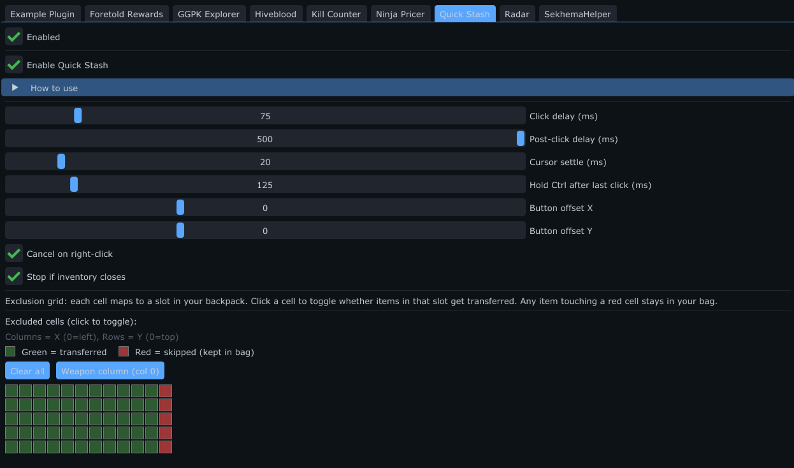
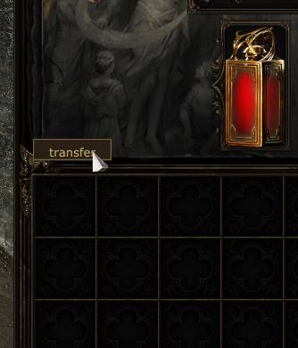

# Quick Stash

**Version 1.3.2** — written and maintained by **Ömer Faruk ARPA**.

A [PoeFixer](https://github.com/POEFixer/PoeFixer) plugin for **Path of Exile 2** with two one-click flows:

- **Transfer** — dump your inventory into whatever storage panel is open (stash, vendor, trade, gamble, …) via Ctrl+click.
- **TAKE (new in 1.2.0)** — the reverse: pull items **out** of the open stash tab back into your inventory. Type in Path of Exile's own **"Highlight Items"** search box and a **TAKE** button appears right above it; it Ctrl+clicks every matching item back to your bag.

> **About.** This is now effectively a ground-up plugin. It began from the
> QuickStash idea — a Ctrl+click quick-stash button (original author
> unknown / unlinked) — but the current codebase is its own implementation:
> a non-blocking, frame-paced click state machine; the TAKE / withdraw flow;
> reading Path of Exile's native "Highlight Items" box through the UI tree;
> and extensive crash-hardening and safety work. Written and maintained by
> Ömer Faruk ARPA. See [Changes in 1.3.0](#changes-in-130),
> [1.2.0](#changes-in-120), [1.1.1](#changes-in-111), and [1.1.0](#changes-in-110).

## Demo


## Features

- **Transfer button** — Appears above your backpack grid whenever the main inventory is open.
- **One-click dump** — Ctrl+clicks every non-excluded occupied slot into the panel on the other side of the trade (stash tab, shop, player trade, etc.).
- **TAKE (withdraw)** — Ctrl+clicks matching items **out** of the open stash tab and into your inventory. Filtered live by whatever you type in Path of Exile's native **"Highlight Items"** search box — no separate input to manage.
  - **Matches item mods too (new in 1.3.0)** — the filter also reads each item's mods, so words like `chaos`, `bleeding`, `pack`, `rarity`, or `waystone` match the relevant items, just like the game's own highlight. Toggle off any time with **"Match item mods in filter"**.
  - **`corrupted` matches corrupted items (fixed in 1.3.2)** — corruption is read from the item's mod data, so it needs "Match item mods in filter" on (the default).
  - **Ritual windows are ignored (1.3.2)** — the Ritual "Favours" window is no longer treated as an open stash, so TAKE and its highlights stay away from tribute items.
  - **Live highlight overlay** draws a box around every item TAKE will grab, so you see the selection before clicking.
  - **`TAKE (N)`** shows the number of Ctrl+clicks (item stacks); for stacked currency it also shows the **total quantity** (e.g. `TAKE (3)  x30` for three stacks of 10).
  - Works on normal grid tabs **and** special/affinity tabs (currency, fragments, …) via automatic per-item / grid coordinate resolution.
  - **Never targets your own bag, equipment, or charm slots.**
- **Exclusion grid** — Click cells in settings to skip slots (weapon column excluded by default). Presets: weapon column only, clear all, select all.
- **Timing controls** — Click delay, post-click delay, cursor settle, and hold Ctrl after the last click for reliable transfers.
- **Safety options** — Cancel on right-click; stop if inventory closes mid-transfer.
- **Button position** — Optional X/Y offset sliders; default placement is built in (offsets `0` / `0` = standard spot above the grid).
- **Debug mode** — Optional inventory / UI-tree inspectors, off by default (no overhead unless enabled).

### Settings panel



### Transfer button in-game




## Requirements

- [PoeFixer](https://github.com/POEFixer/PoeFixer) with plugin SDK v6 support
- Path of Exile 2 (Windows)
- PoeFixer’s built-in auto-stash should be **disabled** if you use this plugin, to avoid conflicting Ctrl+click behavior.

## Install (release build)

Pre-built binaries are published on GitHub:

1. On GitHub, open the **Releases** section for this repository and download the latest **`QuickStash-*.zip`**.
3. Extract the archive. You should get a `QuickStash` folder containing at least:
   - `QuickStash.dll`
4. Copy that folder into your PoeFixer install:

   ```
   <PoeFixer>\Plugins\QuickStash\
   ```

   Example:

   ```
   C:\Games\PoeFixer\Plugins\QuickStash\QuickStash.dll
   ```

5. Start (or restart) PoeFixer and enable **Quick Stash** under **Plugins**.
6. Open the plugin settings to adjust exclusions and timings. Settings are saved to:

   ```
   Plugins\QuickStash\config\settings.json
   ```

## Usage

### Transfer (inventory → stash)

1. Open your character inventory.
2. Open the target inventory (Stash, Shop, Trade...).
3. Click **transfer** on the button above the grid.
4. Items move in slot order; excluded cells and empty slots are skipped.

Right-click during a transfer cancels it (if enabled in settings).

### TAKE (stash → inventory)

1. Open your character inventory **and** a stash tab.
2. Type in Path of Exile's own **"Highlight Items"** box at the bottom of the screen (e.g. a base type or unique name). Leave it empty to take everything on the tab.
3. Matching items are outlined; a **TAKE (N)** button appears just above the Highlight Items box.
4. Click **TAKE** — every outlined item is Ctrl+clicked back into your inventory.

Right-click / alt-tab cancels a running TAKE, same as transfer.

> **Note on filtering.** TAKE matches your search text against each item's **base type, unique name, and internal path** (and future builds, item mods). It reads what you type in Path of Exile's native highlight box, so the plugin does not add its own text field.

## Build from source

**Requirements:** Visual Studio 2022 (MSVC v143), Windows SDK 10.0, C++20

```powershell
& "${env:ProgramFiles(x86)}\Microsoft Visual Studio\2022\BuildTools\MSBuild\Current\Bin\MSBuild.exe" `
  QuickStash.sln -p:Configuration=Release -p:Platform=x64
```

Output: `bin\Release\QuickStash.dll`

Copy the DLL to `Plugins\QuickStash\` in your PoeFixer directory, same as the release install step.

## Project layout

```
QuickStash.cpp              Plugin entry (lifecycle, settings UI, overlay)
config/Settings.h           JSON settings (delays, exclusions, offsets)
game/PanelDetector.h        Inventory / open-stash detection
game/TransferPlanner.h      Transfer click queue + grid coordinate math
game/TransferState.h        Non-blocking, frame-paced click state machine
game/WithdrawPlanner.h      TAKE: candidate collection, filter, screen-rect resolution
game/PoeHighlight.h         Reads PoE's native "Highlight Items" box via the UI tree
input/Win32Input.h          Cursor move + Ctrl+LMB via SendInput
overlay/TransferButtonOverlay.h   Transfer / TAKE button UI + click handling
ui/ExclusionGrid.h          12×5 exclusion editor in settings
ui/InventoryDiagnostics.h   Debug-mode inventory / UI-tree inspectors
sdk/                        PoeFixer Plugin SDK headers
```

## Changes in 1.3.0

Makes the **TAKE** filter match item **mods**, not just names:

- **Mod-aware filtering** — the "Highlight Items" filter now also matches each
  item's mods. Type `chaos`, `bleeding`, `stun`, `pack`, `rarity`, `waystone`,
  etc. and the matching items light up — the same behaviour as Path of Exile's
  own highlight box. On by default; a **"Match item mods in filter"** checkbox
  turns it off.
- **Waystone reward stats** — Item Rarity, Monster Pack Size, Monster Rarity,
  Monster Effectiveness and Waystone Drop Chance are recognised so those words
  match too (these are "final from map" stats, not plain mod text).
- **Cleaner name matching** — the filter no longer matches an item's hidden
  internal path, so a stray letter can't accidentally select a whole tab.
- **Safe & fast** — mods are read only while you have a filter typed, once per
  item (cached), behind a liveness check and a per-scan cap; the toggle is a
  hard off-switch if you ever want it disabled.
- **TAKE button only shows with a stash open** — no leftover button when the
  stash is closed.

## Changes in 1.2.0

Adds the **TAKE (withdraw)** flow and quality-of-life work:

- **TAKE / withdraw button** — pulls matching items out of the open stash tab
  back into your inventory, driven through the same hardened, non-blocking
  click state machine as Transfer (all Ctrl-hold / alt-tab-abort / watchdog
  fail-safes apply).
- **Reads Path of Exile's native "Highlight Items" box** via the host UI tree —
  you filter with the game's own search field; the plugin adds no separate input.
  The **TAKE** button is placed right above that box.
- **Live selection overlay** outlines every item TAKE will grab.
- **Smart counting** — `TAKE (N)` counts stacks/clicks; stacked currency also
  shows the **total quantity** (e.g. `TAKE (3)  x30`).
- **Robust targeting** — per-item screen rects on special/affinity tabs
  (currency, fragments, …), grid math on normal tabs; small equipment
  inventories (charms/flask) and the player's own bag are never targeted.
- **Debug mode** toggle gates the inventory / UI-tree inspectors (off by
  default, zero overhead when off).

> Known limitation: TAKE matches base type / unique name / item path. Matching
> against item **mod text** (e.g. highlight every item with a fire-resistance
> mod) is planned but disabled in this build for host stability.

## Changes in 1.1.1

Maintenance release — rebuilt for **PoeFixer update 268**:

- **Synced to the current Plugin SDK v6 headers** (matches PoeFixer 268, which
  moved all hardcoded offsets into the core and fixed the GameUI / RootUI
  offsets). The transfer button now positions off the host-corrected inventory
  grid coordinates.
- **No behavioural changes.** The consumed SDK surface is unchanged
  (append-only ABI), so this is a compatibility rebuild — every fix from 1.1.0
  carries over as-is.

## Changes in 1.1.0

Hardened the original 1.0 concept with reliability and safety fixes:

- **No more render-thread stalls.** The transfer is now a non-blocking,
  frame-paced state machine — the old version slept on the render thread on
  every click, hitching the game and overlay. Full framerate during transfers.
- **Crash-safe settings.** A corrupt or hand-edited `settings.json` no longer
  takes down the host; load/save never let an exception cross the C ABI.
- **Reliable Ctrl+click.** Ctrl is injected by scan code (PoE2 reads raw input)
  so items transfer instead of being picked onto the cursor.
- **DPI-correct targeting.** Cursor moves use absolute virtual-desktop
  coordinates, so clicks land correctly on non-100% scaling / multi-monitor.
- **Ctrl can't get stuck.** Fail-safe release via destructor, foreground-abort
  (alt-tab cancels), and a watchdog timeout.
- **Live click coordinates** (handles a panel that moves/scrolls mid-transfer),
  **cursor restore** after a transfer, an **exclusion-grid colour legend**, a
  collapsible **How to use** guide, and an empty-queue notice.

## Disclaimer

This is an unofficial, third-party plugin. It reads game memory and injects
synthetic input. Use of third-party tools may violate the Path of Exile Terms
of Service and could put your account at risk. **Use at your own risk.** This
project is provided for educational purposes and is not affiliated with,
endorsed by, or supported by Grinding Gear Games or the PoeFixer authors.
PoeFixer and Path of Exile are trademarks of their respective owners.

## License

This project's own source code is licensed under the **GNU General Public
License v3.0** — see [LICENSE](LICENSE).

Bundled third-party components keep their own licenses:

- **Dear ImGui** (`imgui/`) — MIT License
- **nlohmann/json** (`third_party/json.hpp`) — MIT License
- **PoeFixer Plugin SDK** (`sdk/PluginAbi.h`, `sdk/PluginSDK.h`) — provided by
  the PoeFixer project; included here so the plugin can be built. These headers
  are the property of the PoeFixer authors and are redistributed only for
  build convenience. If the PoeFixer project objects, they will be removed and
  you will need to supply them yourself from your PoeFixer install.

MIT is GPLv3-compatible, so the combined work may be distributed under GPLv3.
